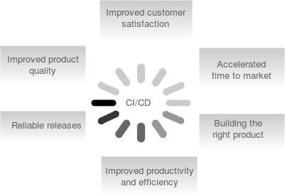
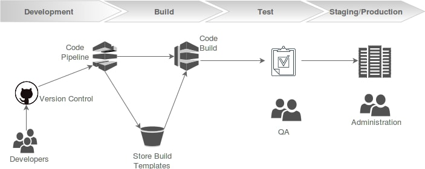
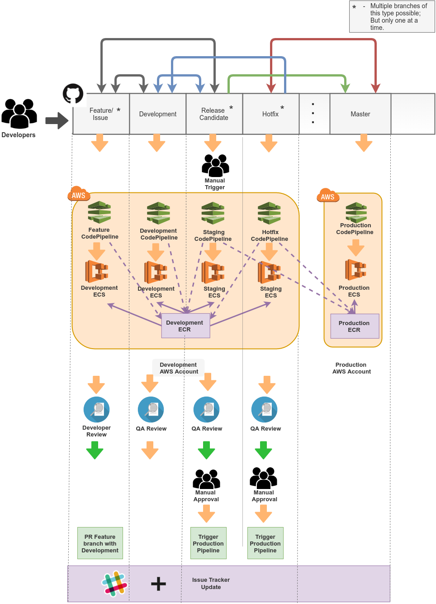
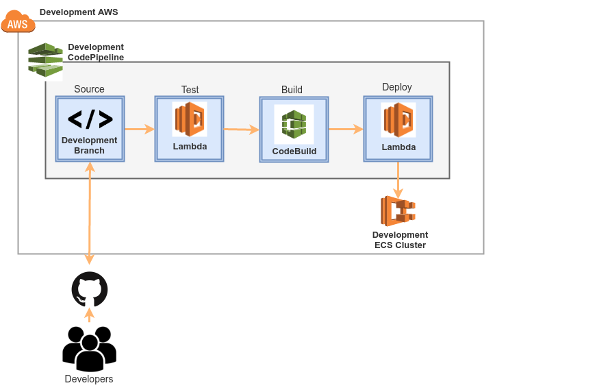
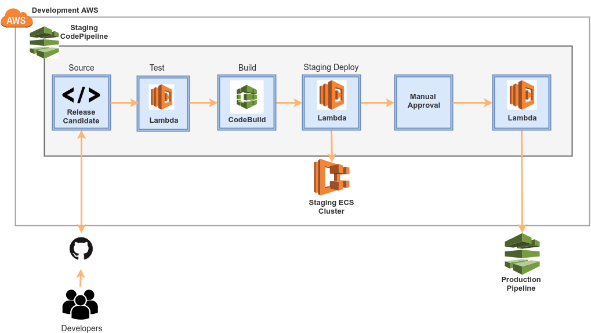

### INTRODUCTION

Continuous integration and deployment is a paradigm shift from the traditional methods of software development and deployment, catering to the next generation of application development  and deployment  platforms which are cloud enabled and integrates seamlessly with PaaS and IaaS based cloud offerings.

This document  focuses on creating a continuous deployment standard, which comprises of a set of best practices and solutions , effectively put together  to deliver business value to the customers in a heterogeneous environment. 

*Continuous Integration* is the practice of testing each change done to your codebase automatically and as early as possible.

*Continuous Deployment* follows the testing that happens during Continuous Integration and pushes changes to a staging or production system. This makes sure a version of your code is accessible at all times.

### Definition of Terms

| Term | Definition |
|------|------------|
| DevOps | An enterprise software development phrase used to mean a type of agile relationship between Development and IT Operations.
| Micro-Services | A method of developing software applications as a suite of independently deployable, small modular services.
| Containerization | Lightweight alternative to full machine virtualization that involves encapsulating an application in a container with its own operating environment.
| Docker  | An open-source program that enables a Linux application and its dependencies to be packaged as a container.
| Continuous Integration | A software engineering approach in which teams produce software in short cycles, ensuring that the software can be reliably released at any time.
| Continuous Delivery | A software engineering approach in which teams produce software in short cycles, ensuring that the software can be reliably released at any time.
  

### Why a CI/CD Development Standard is required ?

Continuous Integration and Deployment  brings multiple benefits to the organization. 

###### *With Continuous Integration:*

* Say goodbye to long and tense integrations

* Increase visibility which enables greater communication

* Catch issues fast and nip them in the bud

* Spend less time debugging and more time adding features

* Proceed in the confidence you’re building on a solid foundation

* Stop waiting to find out if your code’s going to work

* Reduce integration problems allowing you to deliver software more rapidly

###### *With Continuous Deployment:*

* Automate the repetitive tasks and focus on actual testing.

* Make deployments frictionless without compromising security.

* Scale from a single application to an Enterprise IT portfolio.

* Connect your existing tools and technologies (such as CI providers, DevOps tools, or scripts) into a harmonious workflow.

* Integrate teams and processes with a unified pipeline.

* Create workflows across the development, testing, and production environments

* Improve  overall productivity.

### The Deployment Standard

It is critically important for every team to get their deployment workflow in order. Two best practices that have gained a lot of traction over the last few years are Continuous Integration and Continuous Deployment.

This practice consists of various stages as depicted below:

The different stages of CI/CD process are:

* Development

* Build

* Test

* Staging/Production Deployment

### Standard Git Workflow

The aim of creating a git workflow standard for deployment is to maintain a standard that can help developers to work independently or as a group through a single repository. The workflow also allows to streamline independent CICD pipelines for various environments through branching and merging.

### Components of this workflow

###### *Master branch:* 
The master branch will be the official github repo that contains the latest working code. This branch will be released when the testing of an application is completed.

###### *Development branch :* 
The active development of features takes place in this branch. All the feature branches are created from and merged to this development branch.

###### *Feature branch :* 
Instead of committing directly to the master, we create a feature branch with descriptive names like adding-automation-scripts or issue-543. The names should either convey the actual feature or a reference to it. If a single developer is working on the feature, we can pre-tag the name to the feature branch like john/adding-automation-scripts. The feature branch must be created from the development branch.

###### *Pull Requests :* 
Once the feature is completed and updated to the feature branch, developer can make a pull request to the development branch instead of directly merging the code the master. This gives other developers an opportunity to review the changes before they become a part of the development branch and interfere with other developers.

###### *Release Candidate branch:* 
Once the features are completed for the release, a release candidate branch is created from the development branch. This branch will further accept only bug fixes for the features for this release.

###### *Release :* 
Release happens once the Release Candidate is ready to be deployed. We should merge this branch to development as well as the master branch and tag the release version in the master branch.

###### *Hotfix branch :* 
The branch is used in case we are trying to fix a bug in production. We create a branch directly from the master and make the fix and merge to the master as well as development branch.

### CI/CD Solution with AWS and GitHub

This CI/CD solution allows you to securely store and version control your application's source code using GitHub and automatically build, test, and deploy them to AWS EC2 Container Service (ECS).

The different components are:

#### *EC2 Container Service*

In AWS ECS, we run our applications as Cluster Services based on an Task Definition, which contains the application configurations including Docker image of the application, CPU & memory allocation, port mappings, environment variables and so on.

The docker images to be deployed to the ECS Cluster are stored in the ECS Repository. We need to create a repository for each of our application that we need to run on ECS. ECS brings following capabilities to our CI/CD solution:

* Automatic Deployment using either AWS Console, AWS Cli or AWS SDK

* Scales form one instance to hundreds of instances

* Manages complexity

* Rolling update with no downtime

* Blue-Green deployment

#### *GitHub*

Github manages source code and acts as a Version Control System (VCS) for your microservices.

#### *CodeBuild*

CodeBuild downloads the source code into the build environment and then uses the build spec, included directly in the source code and does the following:

* Build the docker image of the microservice from the source code

* Push the docker image to the ECS Repository with the latest tag (commit Id).

#### *Lambda*

Lambda updates ECS Task Definition and ECS Cluster Service of the application.

#### *S3 Bucket*

S3 Bucket is used as a temporary artifact repository during the CI/CD process.

#### *CodePipeline*

CodePipeline is a Continuous Delivery Service comprising of the CodeBuild and Lambda components mentioned earlier.

###### *Source Stage* 

* When developers commit changes to GitHub repository, CodePipeline automatically detects the changes.

###### *Test Stage* 
* Automated testing is run on the source code using Lambda Function.

###### *Build Stage*

* AWS CodeBuild builds the docker image of the microservice and push it to the ECR with the latest tag.

###### *Deploy Stage*

* CodePipeline deploys the tested and approved code to ECS using AWS Lambda.

### Building CI/CD Solution with AWS and GitHub

The different steps to build a CI/CD solution using AWS and GitHub are as follows:

*Step 1.* Setup the ECS Cluster to which the application will be deployed.

*Step 2.* Create an ECS Repository for the application in the same region as the ECS Cluster.

*Step 3.* Create an S3 bucket in US region for storing the Lambda function.

*Step 4.* Create a build spec file in the application repository to build the docker image and push to ECR Repository created in Step 2.

*Step 5.* Create a CloudFormation template for creating new ECS Task Definition for the application and creating/updating application Service in ECS Cluster. 

*Step 6.* Create the CodePipeline using CloudFormation.

### Managing Multiple Environments

#### *Feature/BugFix*

Every developer will be having a CodePipeline of his/her own. Developers needs to configure the 'Source Stage' in CodePipeline so that it will be watching the branch, the developer is working on.

On pushing a commit to Feature/BugFix branch, the Developer CodePipeline runs automated testing on the source code and if successful, creates a Docker image *{AppName}:feature-{FeatureId}-{revision}*, pushes it to Development ECR, and deploys to Development ECS Cluster.

#### *Development*

Pull Request of completed features, which are successfully verified by developers and planned for next release, are merged to Development branch. Development Pipeline gets triggered and runs automated testing on the source code and if successful, creates a Docker image *{ImageName}:{ReleaseVersion}-snapshot-{revision}*, pushes it to Development ECR and deploys to Development ECS Cluster.

#### *Staging*

The release process starts with manually triggering the Release Candidate/Staging CodePipeline. The CodePipeline creates a new Release Candidate branch from the Development branch. It creates a Docker image *{ImageName}:{ReleaseVersion}-candidate-{revision}* from the source code and pushes it to Development ECR, and deploys to Staging ECS Cluster.

The staging will be undergoing rigorous testing. On successful verification, QA approves the Manual Approval stage in CodePipeline, on which the CodePipeline docker tag *{ImageName}:{ReleaseVersion}* the final revision of Staging Docker image and pushes to Production ECR. It then triggers the Production Pipeline. The Release Candidate branch is tagged with release version and is merged with Master and Development branch.

#### *Production*

Production CodePipeline is triggered by either by Staging CodePipeline or HotFix CodePipeline. It deploys the latest Docker image in Production ECR, pushed by Staging/HotFix CodePipeline, to the Production ECS Cluster. After deployment, notifications are send.

#### *HotFix*

When an issue is found in Production environment and requires immediate resolution, we make use of a HotFix branch which is created from Master branch.

Developers fixes the issue in HotFix branch, which will trigger the HotFix Pipeline. This creates a Docker image *{ImageName}:{ReleaseVersion}-hotfix-{HotfixID}-{revision}* from the source code and pushes it to Development ECR and deploys to Staging ECS Cluster in Development AWS Account.

The HotFix environment will be undergoing rigorous testing. On successful verification, QA approves the Manual Approval stage in CodePipeline, on which the CodePipeline docker tag *{ImageName}:{ReleaseVersion}-hotfix-{HotfixId}* the final revision of HotFix Docker image and pushes to Production ECR. It then triggers the Production Pipeline. The HotFix branch is tagged with release version and is merged with Master branch and Development branch.

### CI/CD Best Practices

* Maintain one repository per service. This isolation will reduce the engineer’s ability to cross-populate code into different services.

* Each service should have independent CI and Deployment pipelines so you can independently build, verify and deploy. This will make set-up easier, require less tool integration, provide faster feedback and require less testing.

* Your solution must be tools/environment agnostic so you can support each team’s workflow and tool chain, no matter what they are.

* Your system needs to scale to serve the myriad services and pipelines.

* Auditability needs to be built into your pipeline automatically so you always record in the background the log of each artifact as it makes its way through the pipeline. 

* Your automation platform needs to enable you to normalize your pipelines as much as possible. Therefore, use parameters and modeling of the applications/environment and pipeline processes so you can reuse pipeline models and processes between services/teams.

* Allow for both automatic and manual approval gates to support regulatory requirements or general governance processes.

* Your solution should provide a real-time view of all the pipelines’ statuses and any dependencies or exceptions.

* Consistent logging and monitoring across all services provides the feedback loop to your pipeline. Make sure your pipeline automation plugs into your monitoring so that alerts can trigger automatic processes such as rolling back a service, switching between blue/green deployments, scaling and so on.

### Conclusion

Moving to Continuous Deployment will change the development dramatically. It will make the workforce more productive and lead to a more stable and better product. Once setup, you can then reap the benefits of deploying new versions several times a day.

To accomplish this, companies must have a straightforward and repeatable deployment standard. Most reliable, is an automated deployment pipeline that can feed into any environment.
