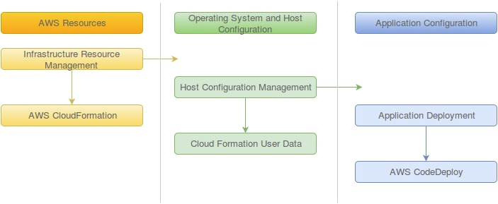
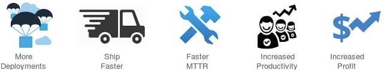

## NEXT GENERATION PLATFORM
### Introduction

One of the major trends in IT over the past few years has been increased automation and a concurrent decrease in the need for human or manual intervention. Many IT teams still rely on manual configurations, custom scripts, golden images or outdated tools to manage infrastructure, resulting in errors and slow deployments. Organizations looking for faster deployments treat infrastructure like software: as code that can be managed with the same tools and processes software developers use, such as version control, continuous integration, code review and automated testing.

Using NGP to describe your infrastructure lets you make infrastructure changes more easily, rapidly, safely and reliably.

Infrastructure as code is the prerequisite for common DevOps practices such as version control, code review, continuous integration and automated testing which in turn delivers quality software.

### Definition of Terms

Term | Definition
---- |-----------
IaC : Infrastructure as Code | IaC is the process of managing and provisioning computing infrastructure through definition files.
Micro-Services | A method of developing software applications as a suite of independently deployable, small modular services.
DevOps | An enterprise software development phrase used to mean a type of agile relationship between Development and IT Operations.
Containerization | Lightweight alternative to full machine virtualization that involves encapsulating an application in a container with its own operating environment.
Continuous Delivery | A software engineering approach in which teams produce software in short cycles, ensuring that the software can be reliably released at any time.
Docker | An open-source program that enables a Linux application and its dependencies to be packaged as a container

### Next Generation Platform

The Next Generation Platform is an IaC (Infrastructure as Code) base, that helps you model and set up a complete infrastructure and related services to run your microservices. This IaC provisions infrastructure on AWS Cloud. The IaC is written using [AWS Cloudformation][cloudformation].

Developers can run the IaC on AWS CloudFormation which will create different resources like AWS Infrastructure (Storage, Network, Compute), ECS Cluster on top of that infrastructure and different microservices/docker containers on top of ECS cluster.
 Developers can plug and play with different modules available with NGP.

### **Why NGP is Important ?**

This platform is the middleware of end-to-end infrastructure as code. Operations can be just as responsive as any other part of the organization and NGP is right in the middle of that because it allows operations team to run and deliver to business an ever-evolving mix of applications that are growing, transforming, decommissioning and resetting expectations about which direction business is going.

Some major characteristics of NGP are:

##### 1. *Simply define infrastructure*

NGP helps to define the state of your infrastructure and deploy it faster with greater reliability. The team no longer have to map out and manually deploy every step.

##### 2. *A foundation for DevOps*

NGP - IaC can be a foundation for common DevOps practices such as version control, code review, continuous integration and automated testing.

##### 3. *Gain visibility across your infrastructure*

NGP gives a clear trail of the state of your infrastructure. This also helps us to configure the infra and remediate back to the desired state if required.

##### 4. *Enabling your business to experiment in new markets*

NGP enables business to experiment new services from market by provisioning the infra required within minutes.

NGP incorporates following solutions to speed up business processes:

1. *Infrastructure as Code*: Manage infrastructure as code for reliable, repeatable configurations.

2. *Microservices*: Manage all the complexity of application code by treating them as microservices.

3. *Continuous* *Delivery*: Adopting infrastructure as code enables continuous delivery practices like version control and continuous integration.

4. *Logging and monitoring*: Ensure speedy and reliable deployments by detecting bottlenecks and monitoring application performance.

### Current Challenges for Quality and Innovation

Every business faces a lot of challenges while executing innovative ideas in regulation with quality and compliance. This slows down the innovative growth. NGP provides solutions to various challenges while executing an idea and helps turn that to a value add for business.

* It takes weeks to set up new systems or software with manual process. With, NGP new infrastructure can be set up within minutes.

* The legacy systems are inflexible and hard to change. With NGP, we can easily migrate to on-demand, cloud based infrastructure.

* Organizational Silos can be avoided as NGP will introduce a standard among teams as they are aligned towards common goals.

* NGP offers continuous delivery of infrastructure and applications and ensures safe, rapid delivery of incremental value.

### NGP - Infrastructure as Code Workflow

### NGP Features

##### *Modularization*

NGP provides a modular architecture which is well suited for cloud-based environments. NGP enables microservices which breaks large software projects into loosely coupled modules, which communicate with each other through simple APIs. Individual modules are responsible for highly defined and discrete tasks.

##### *Componentization*

NGP has the ability to replace parts of a system, comparing with stereo components where each piece can be independently from others.

##### *Standards* *Between Teams*

NGP helps to evolve a standardization between teams, by providing best practices and standards for microservices. This helps to achieve greater productivity by reducing silos among teams

##### *Twelve-Factor App Practices*
  
The Twelve Factors | Description
-------------------| -----------
Codebase | One codebase tracked in revision control, many deploys
Dependencies | Explicitly declare and isolate dependencies
Config | Store config in the environment
Backing Services | Treat backing services as attached resources
Build, release, run | Strictly separate build and run stages
Processes | Execute the apps as one or more stateless processes
Port binding | Export services via port bindings
Concurrency | Scale out via the process model
Disposability | Maximize robustness with fast startup and graceful shutdown
Dev/prod parity | Keep development, staging and production as similar as possible
Logs | Treat logs as event streams
Admin processes | Run admin/management tasks as one-off processes

### Business Benefits of NGP

Embracing Infrastructure as Code is primarily going to keep developers happy. This gives way to two indirect benefits: a reduction in shadow IT and reducing expenses from man hours.

From a monetary perspective, this is a way to run things much more quickly and less error prone and there is much less risk.

From a time management perspective, this is helpful because, if you can reduce how long it takes to do something from four days of man hours to 15 minutes of man hours, then that person is able to do other things.

The business benefits of NGP, which incorporates IaC, microservices and automation are many, some of them are listed below:

##### *Benefits from dynamic cloud environments provided by NGP:*

##### *Benefits from Infrastructure as Code:*

##### *Business benefits of Microservices*

* Follow the Single Responsibility Principle

* Resilient/Flexible – failure in one service does not impact other services.

* High scalability – demanding services can be deployed in multiple servers to enhance performance and keep away from other services so that they don’t impact other services.

* Easy to enhance – less dependency and easy to change and test

* Low impact on other services – being an independent service, this has less chance to impact other services.

* Easy to understand since they represent the small piece of functionality

* Ease of deployment

* Freedom to choose technology – allows you to choose technology that is best suited for a particular functionality

### Executive Summary

Next Generation Platform is an approach to managing IT infrastructure for the age of cloud, microservices and continuous delivery.  The basic idea is that you treat your IT infrastructure as software. This helps you to make changes to it rapidly and easily, at the same time safely and reliably.

To sum up the benefits of using NGP:

##### *Speed*

* Faster development and deployment

* Faster Mean Time To Repair (MTTR)

##### *Innovation*

* Autonomy of teams, culture of change

* Ownership and DevOps culture

##### *Quality*

* Enables modularity and is more open to change in general

* Composability and reusability, more maintainable code

* Better scaling and optimizations

Please refer the blog [The Next Gen Platform with AWS](projects/The-Next-Gen-Platform-with-AWS.md) for getting started with NGP.

[cloudformation]: <https://aws.amazon.com/cloudformation/>