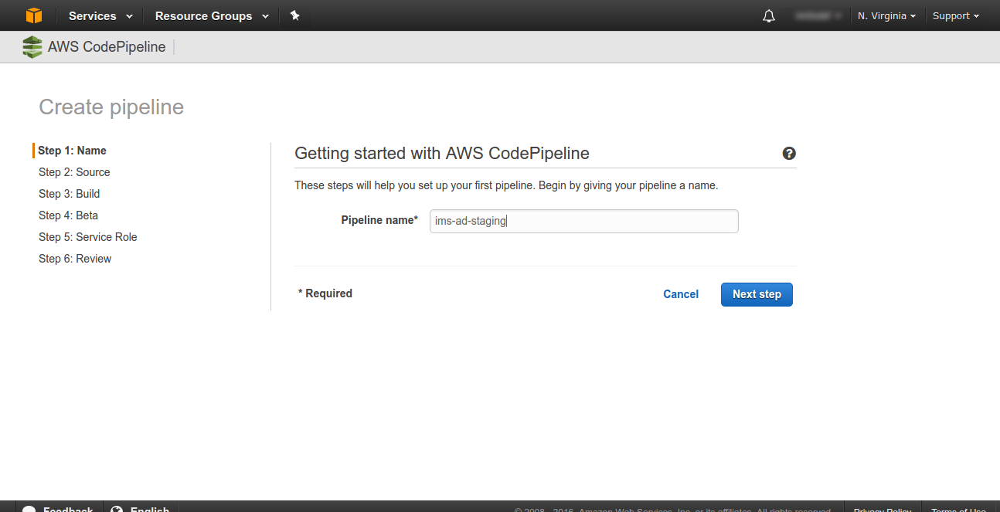
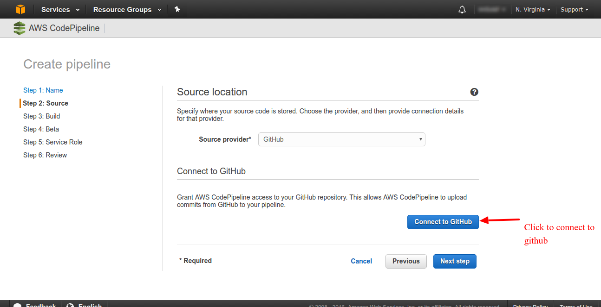
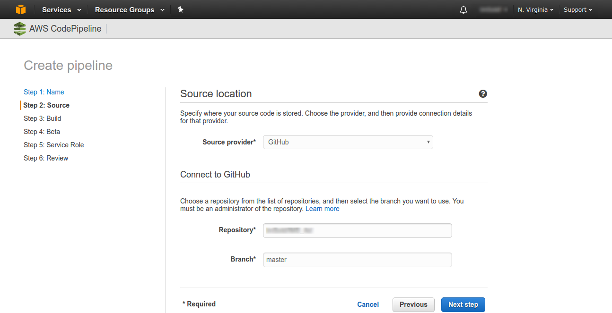
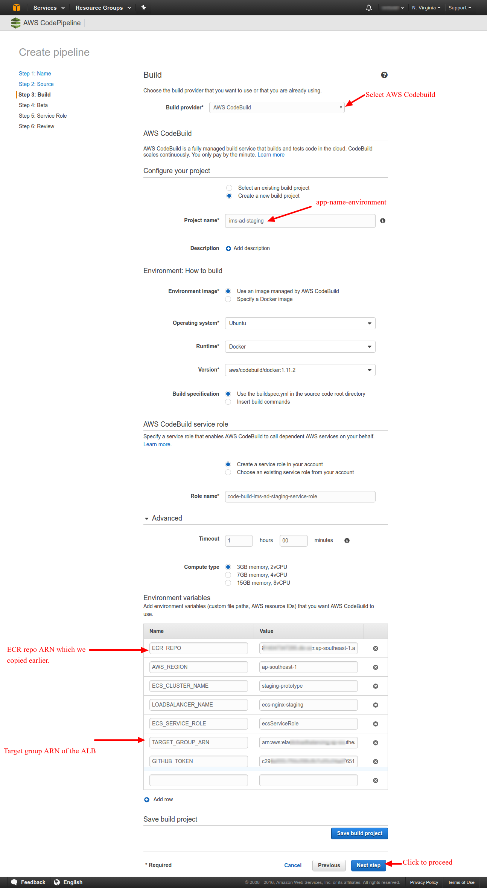
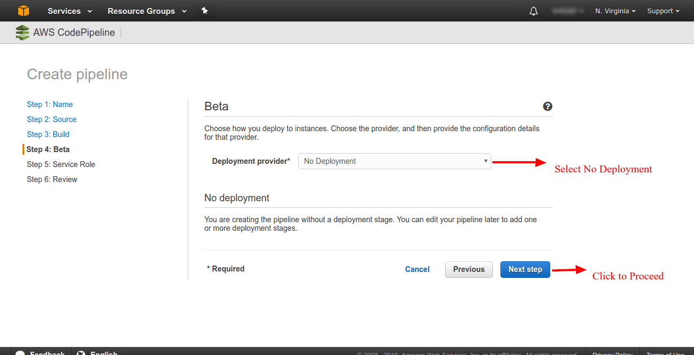
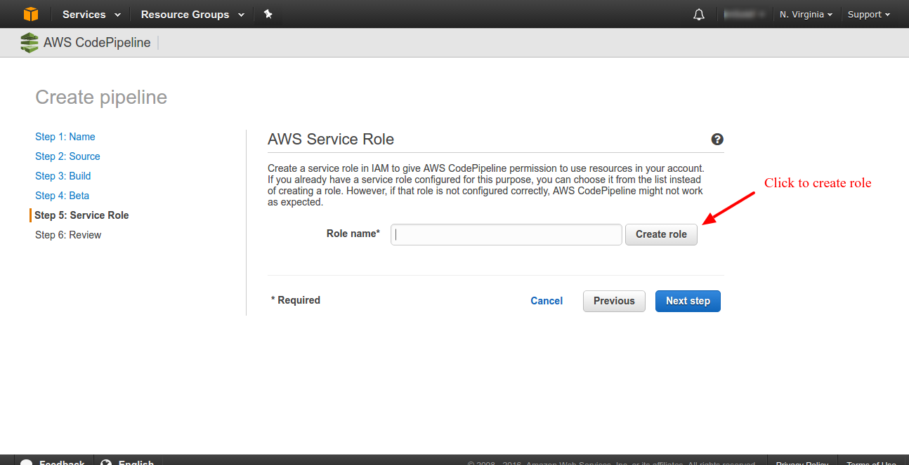
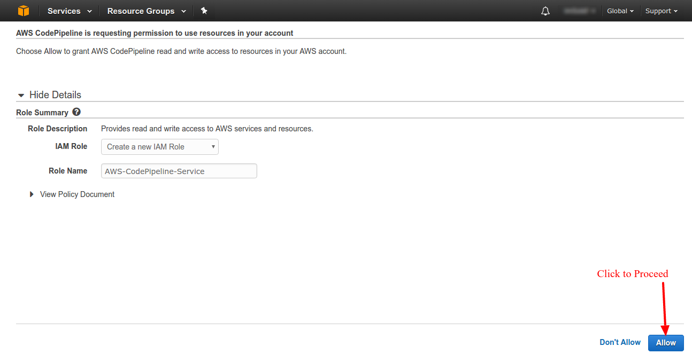
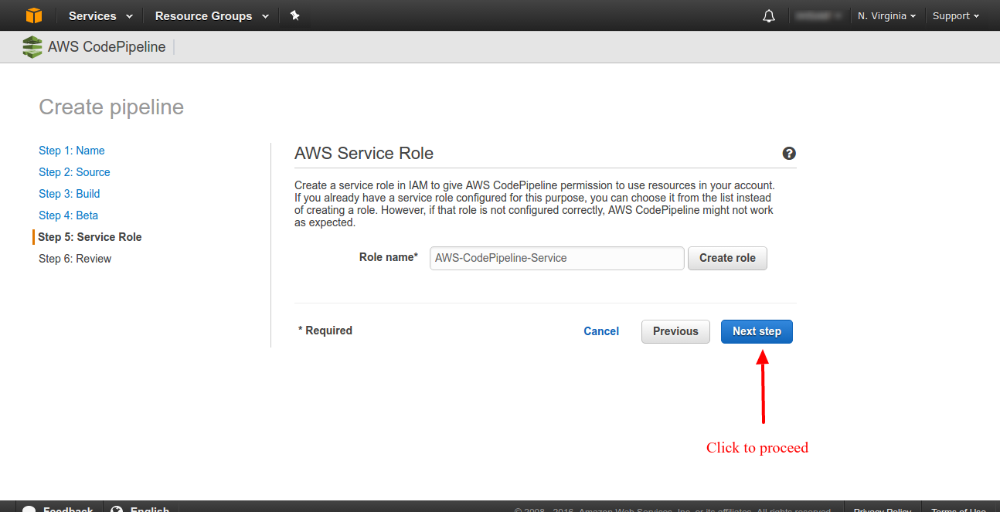
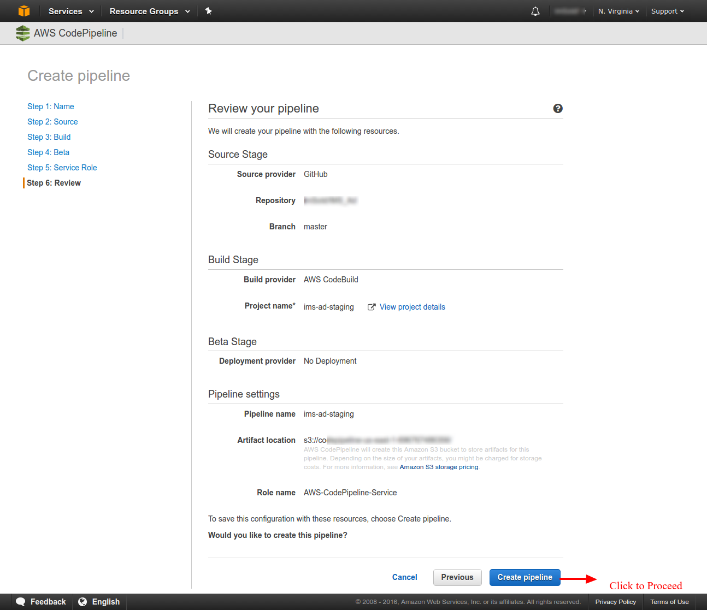

#### AWS CodePipeline

We have prepared an Infrastructure as code for automating the pipeline creation. The steps can be found [here](https://github.com/microservices-today/IaC-ngp-cicd-aws).

##### These steps can be followed to create Codepipeline manually.

1. Go to https://console.aws.amazon.com/codepipeline/home?#/create/Name
2. 
3. 
4. 
5. 
6. 
7. 
8. 
9. 
10. 
