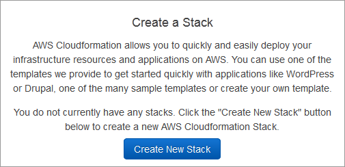

### Steps to create elastic stack

##### 1. Download template file
- Clone [IaC-ngp-elastic][iac-ngp-elastic] repo.

##### 2. Create a stack on the AWS CloudFormation console
1. Log in to the AWS Management Console and select CloudFormation in the Services menu.
2. Create a new stack by using one of the following options:
 - Click **Create Stack**. This is the only option if you have a currently running stack.

 - Click **Create New Stack** in the CloudFormation Stacks main window. This option is visible only if you have no running stacks.

##### 3. Selecting the Stack Template
1. Select **Upload a template to Amazon S3** under **Choose a template** section.
2. Select **elastic.yaml** from cloned repo. Choose **Choose File** to select the template file from your local computer.
3. Click **Next** to accept your settings and proceed.

##### 4. Specifying Stack Name and Parameters
- Specify the stack name and values for the parameters that were defined in the template.

##### 5. Stack Creation Successful
- If the stack creation is successful you will see a **CREATE_COMPLETE** message in status section.

[iac-ngp-elastic]: <https://github.com/microservices-today/IaC-ngp-elastic>

Please refer the [blog](Steps-to-verify-elastic-stack-creation.md) For verifying  elastic stack creation.