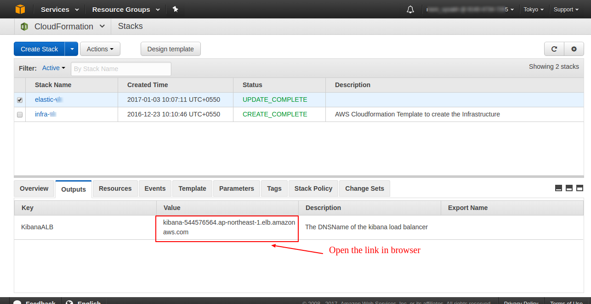
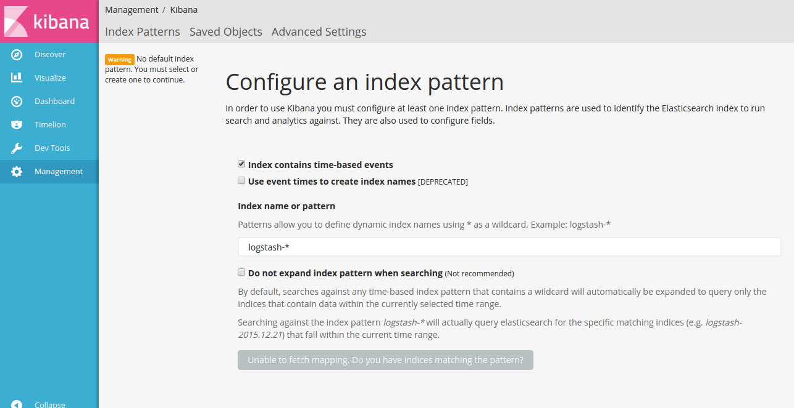

### Steps to verify elastic stack creation

##### 1. Open kibana interface

1. Open the kibana ALB DNSName in a browser tab
 - you can find the ALB DNSName form stack output list
 - also you can find the ALB DNSName form Load Balancers list in AWS console.



2. The link will open up kibana interface.



##### 2. Create a Management instance in public subnet
1. Bring up a CentOs instance in our public subnet inorder to access ELK instances.
2. SSH in to Management instance.
```
    ssh-add <pem>
    ssh -A centos@<ip>
```
##### 3.Inastall filebeat 5.1.1

```
 curl -L -O https://artifacts.elastic.co/downloads/beats/filebeat/filebeat-5.1.1-x86_64.rpm
 sudo rpm -vi filebeat-5.1.1-x86_64.rpm
```
4. Update file beat logstash configuration
- Switch to root user
```
sudo su
```
- Open filebeat.yml
```
vi /etc/filebeat/filebeat.yml
```
- Comment default elastcsearch configuration
- Uncomment logstash configuration and update host with logstash elb DNSName
```
output.logstash:
  # The Logstash hosts
  hosts: ["<logstash-elb-DNSname>:80"]
```
- restart filebeat service
```
systemctl restart filebeat
```
5. Verfiy results in kibana
