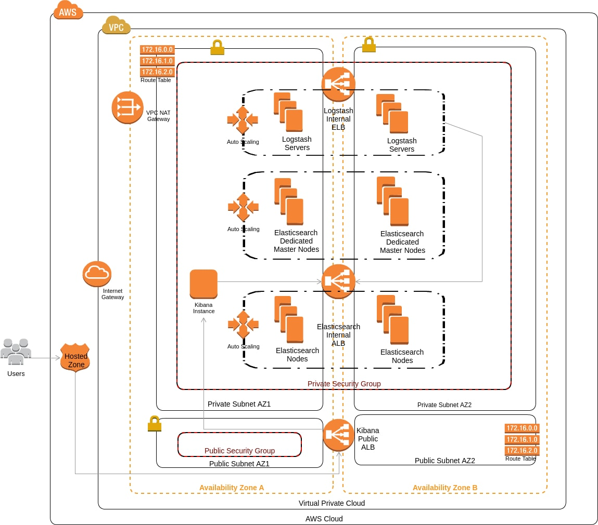

### Overview

The Next Gen Platform - Elastic (NGP Elastic) enables the creation of an [Elastic Stack][elastic] on AWS Cloud. This IaC will create the following for you:
- ElasticSearch 5.1.1 Cluster
- Logstash 5.1.1
- Kibana 5.1.1

The AWS Infrastructure architecture diagram for Elastic Stack is shown below:


#### ElasticSearch Cluster

Elasticsearch is an open source search server that is used for real-time distributed search and analysis of data. For setting up Elasticsearch cluster, we are creating the following resources on AWS:
- Launch Configuration and Autoscaling Group for Master Nodes
- Launch Configuration and Autoscaling Group for Data Nodes
- Security Groups
- IAM Role, Policy and Instance Profile
- Application load Balancer (ALB)

We install Elasticsearch as `rpm package` on CentOS. The installation requires Java to be installed first.
We also install the elasticsearch-plugin `discovery-ec2` to discover the nodes in the cluster.
To configure the Elasticsearch cluster, we edit the `/etc/elasticsearch/elasticsearch.yml` file. Following changes are made for an easticsearch node:
```
cloud:
  aws.region: REGION
...
...
cluster.name: CLUSTER_NAME
...
...
bootstrap.memory_lock: true
...
...
network.host: 0.0.0.0
...
...
discovery:
  zen.hosts_provider: ec2
  ec2.tag.Name: "EC2_TAG_NAME"
```
For a dedicated master node, following two lines are appended to the config file along with the above changes:
```
node.master: true 
node.data: false
```
The elasticsearch cluster is started using `systemctl start elasticsearch`. 

You can test the health of your cluster by running the below command on any elasticsearch node:
```
curl http://localhost:9200/_cluster/state?pretty
```

Your elasticsearch cluster is accessible to the client servers via the ALB DNS name.

#### Logstash

Logstash is an open source tool for collecting, parsing, and storing logs for future use. It is possible to use Logstash to gather logs of all types. For setting up Logstash, we are creating following resources on AWS:
- Launch Configuration and Autoscaling Group for Logstash nodes.
- Security Group
- Elastic Load Balancer(ELB)
- Route53 record to create a friendly DNS name for ELB

We install Logstash as `rpm package` on CentOS. Logstash installation requires Java as a pre-requisite. To define the input and output for logstash, we create a config file `/etc/logstash/conf.d/logstash.conf` with the following contents:
```
input {
    beats {
        port => "5044"
    }
}
output {
    elasticsearch {
        hosts => ["http://ELASTICSEARCH_URI:80"]
    }
}
```
We replace the `ELASTICSEARCH_URI` with the DNS name of Elasticsearch ALB. Logstash service can be started on nodes using `systemctl start logstash`.
The Logstash Route53 record provides the end-point for logstash.

#### Kibana

Kibana is a web interface that can be used to search and view the logs that Logstash has indexed. We are creating following resources on AWS to set up Kibana:
- EC2 Instance
- ALB, ALB Listener and Target Group
- Route53 Record

Kibana can be configured by editing `/etc/kibana/kibana.yml` and specifying the elasticsearch url.
We can run Kibana with `systemctl start kibana`.
The Kibana interface can be accessed by using Kibana Route53 record.

#### Installing and Testing Elastic Stack

Please refer the blog [Steps to Create Elastic Stack](../elastic-stack/Steps-to-create-elastic-stack.md) to install Elastic Stack on AWS using [IaC-AWS-Elastic][elastic-iac]

Please refer the blog [Verify Elastic Stack Creation](../elastic-stack/Steps-to-verify-elastic-stack-creation.md) for verifying elastic stack creation.

[elastic]: <https://www.elastic.co/products>
[elastic-iac]: <https://github.com/microservices-today/iac-ngp-elastic>
