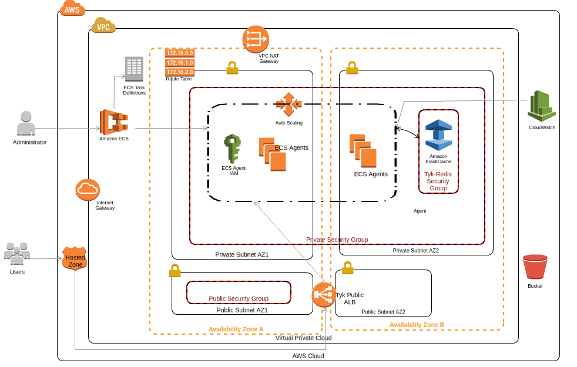
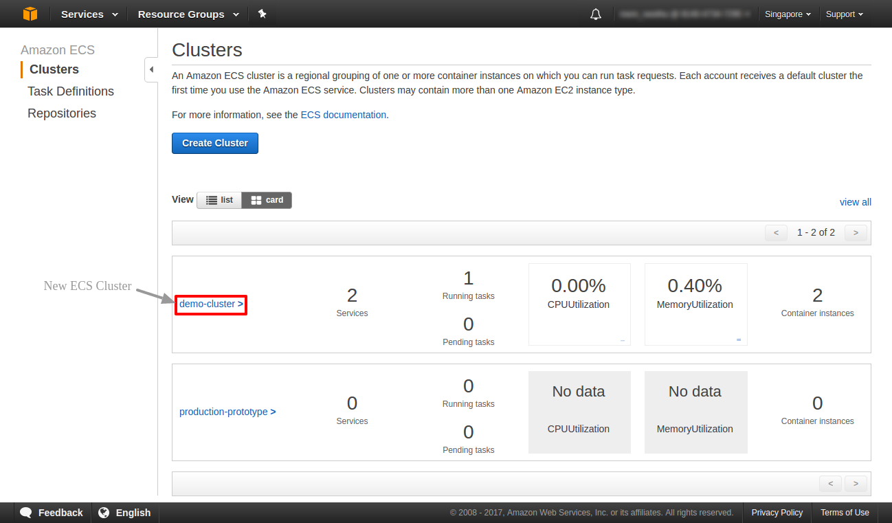
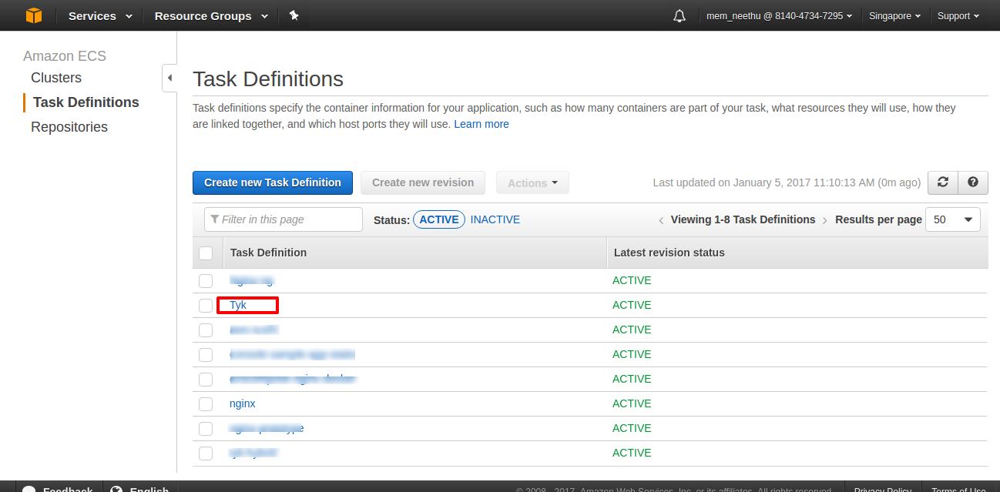
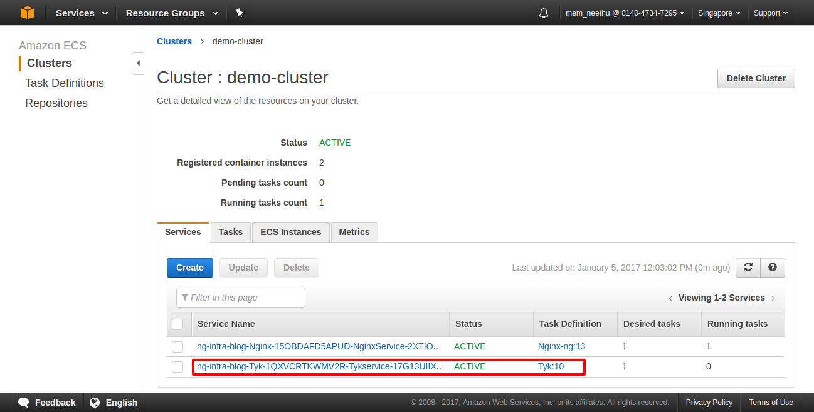
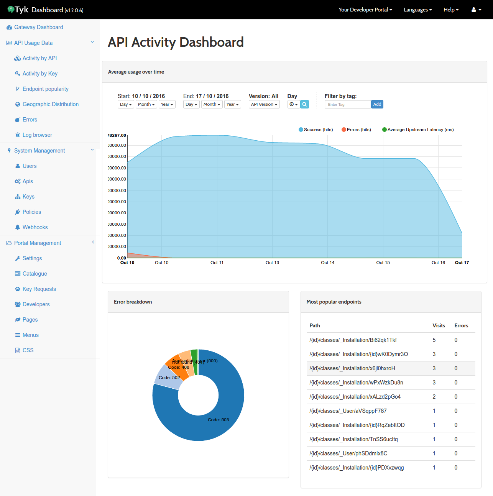
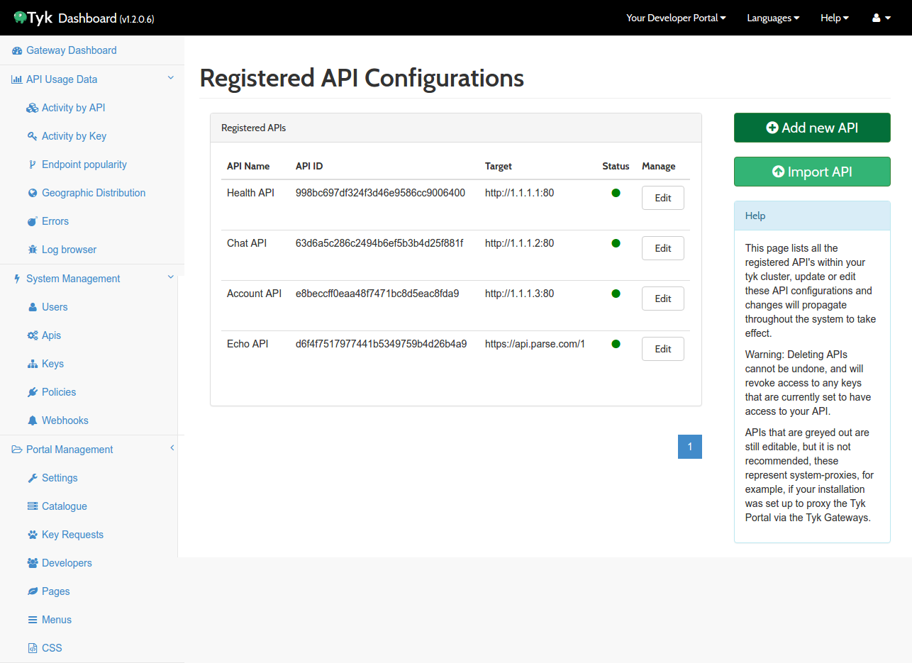

### Overview
The Next Gen Platform(NGP) with AWS enables Infrastructure as Code to provision and manage a complete infrastructure that can be used to create microservices using ECS (EC2 Container Service). 
The Infrastructure as code is written using [AWS CloudFormation][cloudformation]. 

The different modules that are installed and managed using this IaC are:
 a. Infrastructure
 b. EC2 Container Service (ECS)
 c. Nginx
 d. Tyk API Gateway

### NGP with AWS Infrastructure Design



### Infrastructure

This is a default module. This will create the infrastructure required to create the ECS cluster. This will be created even if you provide 'n' to other modules.
Following resources will be created:
- VPC
- Public and Private Subnets in two availability zones
- Public and Private security groups
- Public abd Private Route tables
- Internet Gateway
- NAT Gateway

### EC2 Container Service (ECS)

Amazon EC2 Container Service ([Amazon ECS][amazon-ecs]) is a highly scalable, fast, container management service that helps us to run, stop, and manage Docker containers on a cluster of Amazon EC2 instances.
While running the IaC for NGP with AWS, you can create an ECS Cluster by giving 'y' to the 'ecs' module. 
The ECS cluster can be viewd at AWS console as shown below: 



### Tyk API Gateway

Tyk is an Open Source API Management Platform and Gateway. The full Tyk stack consists of multiple components working together, the three most important ones are:

   - Tyk Gateway: This does all the heavy lifting, and is the actual proxy doing all the work
   - Tyk Dashboard: This is the GUI to control your gateways and view analytics, as well as an extended Dashboard REST API that enables granular integration
   - Tyk Pump: A data processor that moves analytics data from your gateways (redis) into other data sinks, most importantly MongoDB for the dashboard to process.

You can set up Tyk on ECS cluster by giving 'y' to 'tyk' module. This create the following:
- Task definition for Tyk under "Task Definitions" in Amazon ECS console.

- Service for Tyk within ECS cluster.

- Tasks for Tyk under Tyk Service.
- An ALB to access Tyk.
- A user-friendly DNS name. (The pre-requisite would be to have a hosted zone within Route53)

- Tyk dashboard is accessible at http://admin.cloud.tyk.io/ (The pre-requisite would be to setup Tyk Hybrid account from https://cloud.tyk.io/signup).




### Implementing Next Gen Platform with AWS

#### Pre-requisites
- AWS IAM account with administrator privileges (Save your AWS IAM access key ID and secret access key).
- AWS CLI
- An S3 bucket to store the templates.
- Accept Software Terms of AWS Marketplace for CentOS. 
- Setup Tyk Hybrid account from https://cloud.tyk.io/signup for running Tyk API
- A hosted zone in AWS Route53 for your domain name. This is required to create a record for creating a friendly dns name for the load balancers.

#### Steps
- Export AWS credentials as bash variables
```
export AWS_ACCESS_KEY_ID="anaccesskey"
export AWS_SECRET_ACCESS_KEY="asecretkey"
export AWS_DEFAULT_REGION="ap-northeast-1"  //(e.g. ap-northeast-1 for Tokyo and ap-southeast-1 for Singapore region)

```
- Clone the repo [IaC-ngp-aws][iac-ngp-aws]
- Change directory to IaC-ngp-aws
- Run bash bin/configure.sh to decide which modules to run.
- Give the S3 bucket name when requested.
- Provide the aws region(when requested) where you need to create the stack.
- Click the link to open the CloudFormation console with template URL already in place.
- Provide the requested parameters in the AWS CloudFormation console.
- Important - Click the checkbox "I acknowledge that AWS CloudFormation might create IAM resources with custom names." under Capabilities section.
- Review the information for the stack. When you're satisfied with the settings, click 'Create'.
- To monitor the progress of the stack, select your stack and in the Stack Details pane, click the Events tab.
- To delete the stack and its resources, from the AWS CloudFormation console, select the stack and click Delete.

#### Steps to Import a New Module

- Create a folder with module-name in modules directory and add the following files within that folder:
(Refer [Infrastructure][infrastructure] Module)
  a. module.yaml : The CloudFormation template to create the module.
  b. ngp-parameters-addon.yaml : User Input parameters required for module.
  c. ngp-resource-addon.yaml : The pluggable part that integrates module with main CloudFormation Stack
- Add module-name to module array in bin/configure.sh.

#### Monitoring ECS Cluster

- The monitoring of ECS cluster agents is done using [Amazon CloudWatch][cloudwatch]. The CloudWatch alarms are configured to monitor CPU and Memory utilization of ECS Agents.
- This will scale up the agents if the utilization exceeds a particular limit.

#### Notes
- Provide the latest stable version while running the “bin/configure.sh” bash script.
- Always provide a uniquely identifiable tag for your deployments.


[cloudformation]: <https://aws.amazon.com/cloudformation/>
[iac-ngp-aws]: <https://github.com/microservices-today/IaC-ngp-aws>
[amazon-ecs]: <http://docs.aws.amazon.com/AmazonECS/latest/developerguide/Welcome.html>
[infrastructure]: <https://github.com/microservices-today/IaC-ngp-aws/tree/master/modules/infrastructure>
[cloudwatch]: <https://aws.amazon.com/cloudwatch/>
